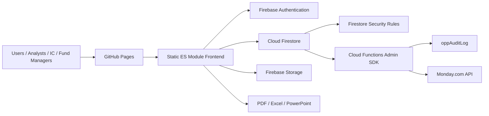

# مراجعة معمارية — مستكشف الفرص العقارية

## الهدف

يوثق هذا المستند البنية التشغيلية الحالية للمنصة بعد إضافة **محرك الذكاء الاستثماري المؤسسي**، ويحدد حدود كل طبقة ومسؤوليتها ومخاطرها التشغيلية قبل مرحلة التوسع إلى 100 ألف+ سجل.

## البنية العامة

## مكونات النظام

| الطبقة | المكوّن | المسؤولية |
|---|---|---|
| Hosting | GitHub Pages | نشر التطبيق كواجهة ثابتة عبر HTTPS |
| Frontend | `index.html`, `src/main.js`, `src/core.js` | واجهة الاستخدام، الحسابات، التسجيل، العرض، التصدير |
| Feature modules | `src/features/*.js` | أنظمة مستقلة: DD، IC، Risk، Portfolio، Reports، Intelligence |
| Identity | Firebase Auth | التحقق من هوية المستخدم قبل Firestore |
| Authorization | `firestore.rules` | فرض صلاحيات كل Collection على مستوى قاعدة البيانات |
| Data | Firestore collections | تخزين الفرص، الصناديق، القرارات، النسخ، الأداء، الفريق |
| Files | Firebase Storage | تخزين ملفات/وسائط الفرص ضمن `opportunity-media` |
| Backend | `functions/index.js` | سجل تدقيق موثوق عبر Admin SDK |
| Backend | `functions/monday-sync.js` | معالجة `mondayTaskQueue` والاتصال بـMonday بدون كشف API token |
| CI | `.github/workflows/ci.yml` | Regression آلي قبل الدمج/النشر |

## قرارات معمارية مهمة

1. التطبيق يبقى static-first لتقليل تكلفة التشغيل وتسهيل النشر.
2. Firestore Rules هي خط الدفاع الحقيقي؛ إخفاء أزرار الواجهة ليس كافياً.
3. السجلات الحساسة مثل `icDecisions`, `underwritingVersions`, `assetActuals`, `transactions` تعتمد append-only أو locked transitions.
4. `oppAuditLog` لا يكتبه العميل؛ تكتبه Cloud Function فقط عبر Admin SDK.
5. Monday API لا يظهر في العميل؛ الطلبات تدخل `mondayTaskQueue` والدالة الخلفية تعالجها.
6. محرك الذكاء الاستثماري المؤسسي طبقة قراءة/تحليل فوق البيانات الحالية ولا يغير محرك الحساب الأساسي.

## مخاطر معمارية حالية

| الخطر | الأثر | المعالجة |
|---|---|---|
| عدم نشر Cloud Functions | سجل التدقيق الحقيقي وMonday sync لا يعملان | نشر `functions` بعد تفعيل Blaze وضبط secrets |
| تحميل مجموعات كاملة في الواجهة | قد يضعف الأداء عند 100k+ سجل | إضافة pagination/query views تدريجياً وفهارس Firestore |
| الاعتماد على CDN libraries | خطر توفر/تغير خارجي | تثبيت الإصدارات الحالية ومراقبة availability |
| لا توجد API server طبقة وسيطة | قواعد معقدة في Firestore | إبقاء العمليات الحساسة append-only أو نقلها تدريجياً إلى Functions |

## بوابات الجاهزية

| البوابة | الحالة المطلوبة |
|---|---|
| Security Rules | كل Collection موثق ومختبر allow/deny |
| Regression | Financial + Rules + Functions + syntax في CI |
| Scale | benchmark أولي وقرار pagination قبل 100k production |
| DR | Firestore export دوري وخطة restore مجربة |
| Observability | Cloud Logging + budget alerts + function error alerts |
