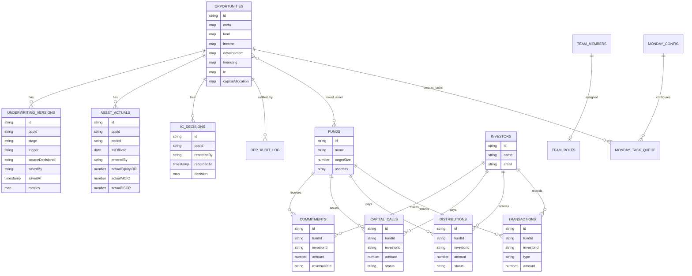

# ERD — نموذج بيانات Firestore

## ملاحظات Firestore

Firestore ليس قاعدة علائقية؛ العلاقات أعلاه منطقية عبر IDs داخل المستندات. لا توجد foreign keys تلقائية، لذلك تُفرض النزاهة الحرجة داخل `firestore.rules` أو Cloud Functions عند الحاجة.
